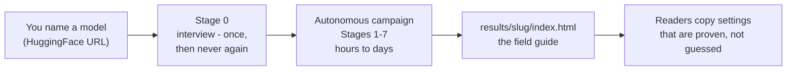
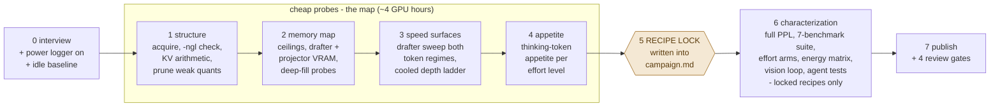
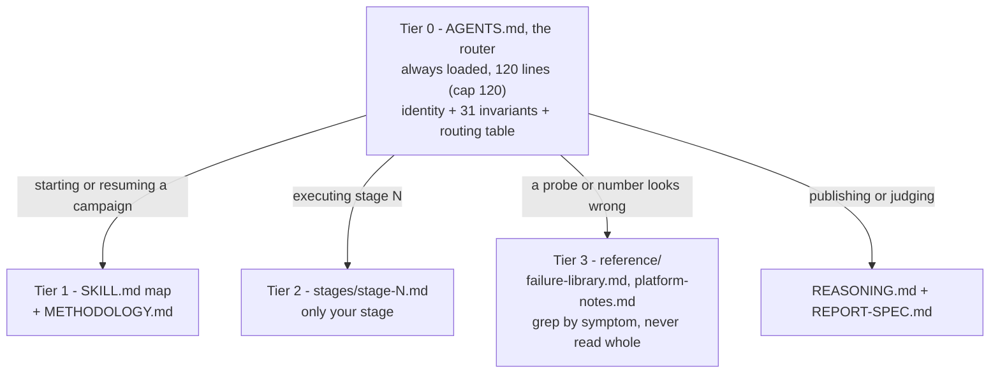

# How measured-inference works

A field-guide generator for local language models: point a coding agent at a
model, answer one round of questions, and hours to days later you have a
published page where **every recommended setting carries the measurement that
justifies it**. This document is the newcomer's map. (A styled HTML version
with the same diagrams is published as a Claude artifact; this file is the
in-repo source of truth.)

## One campaign, end to end

You give it one thing: the address of a model. It interviews you once, then
works alone — downloads the model, measures speed, memory, quality, effort,
energy, and vision on your machine, and writes a web page explaining the best
settings in plain language.



Everything heavy is self-contained and gitignored (`bin/`, `models/`, a
repo-local `.venv`) because the machine may be borrowed. The benchmark inputs
are frozen inside the repo, so two machines — even offline — measure the same
thing.

## The pipeline: eight stages, one gate

Cheap work first, expensive work last. The first stages cost minutes each and
produce a map of what the machine can hold; in the middle sits the **RECIPE
LOCK** (METHODOLOGY rule 25): the campaign must write its final
configurations into `campaign.md` before it may spend hours measuring
anything. The rule exists because a 21-minute, 120 Wh run once produced
nothing — it ran inside a window too small for its measured appetite, and the
probe that would have predicted it costs minutes.



At the gate: an effort level is offered on a recipe only if the window holds
its *measured* thinking appetite — a level nothing can hold is published as
"not offered", never run to truncation. Every planned run names, before it
starts, who consumes its result; a run nothing consumes is cut.

## Governance: three documents and a router

| File | Job |
|---|---|
| `methodology/METHODOLOGY.md` | **The law** — 31 rules, each earned by a measured failure |
| `methodology/REASONING.md` | **The judgment** — how to think so the rules get applied honestly; never pauses a running campaign |
| `templates/REPORT-SPEC.md` | **The contract** — recipes-first page structure, the "Plain words" box, standardized industry metrics, the two-voice writing law |
| `AGENTS.md` | **The router** — always loaded; routes agents to the right document at the right moment |

The two-voice law in one line: every report section opens in plain
international English a non-expert can act on; the engineering depth follows
below and may never contradict the surface.

## Context economy: agents load by tier

An agent should not read the whole repository to do one small job.



Three rules keep it healthy: the **context budget** (Tier 0 is hard-capped;
adding a line means removing one; a new skill registers exactly one routing
line), **laws compress, procedures don't** (each rule is a Tier-0 one-liner
ending in its rule number), and **orchestrators inject** (a subagent's prompt
carries the rules and numbers its task needs; it does not excavate the
corpus). Measured effect: orchestrator boot −57%, stage-executing subagent
−92% (~824 tokens for Stage 3). Those three were measured on 2026-08-23,
against the Tier 0 of that day — 111 lines, 26 invariants — and nothing has
re-measured them since. Tier 0 now sits at its 120-line cap with 31, so they
are the ratio the tiering bought, not a token count of the file above them.

## Reproducibility: frozen inputs, offline first

The rule-21 suite — GSM8K, ALPACA, HumanEval, MeetingBank, MATH-500, MBPP,
MT-Bench at `SEED=42`, n=25, greedy, 16,384 cap — lives frozen in
`scripts/bench/datasets-frozen/`, pinned by the committed manifest
`scripts/bench/suites/rule21-n25.json` (hash `1cdf54f8eb9d3f8f`, 175
prompts). Loading order everywhere: frozen file → local cache → network.
`scripts/make-offline-bundle.ps1` packs every external dependency for USB
transfer. A model never scores its own answers: judge-gated benchmarks run
unscored (transcripts kept) unless an independent judge endpoint exists.

## Repository map

```text
measured-inference/
├─ AGENTS.md                 Tier-0 router: invariants + routing table (start here)
├─ README.md                 the pitch and the pledge
├─ methodology/
│  ├─ METHODOLOGY.md         the 31 rules
│  └─ REASONING.md           how to think while applying them
├─ skills/field-guide/
│  ├─ SKILL.md               campaign map: interview + stage table
│  └─ stages/stage-0..7.md   per-stage playbooks, loaded one at a time
├─ reference/
│  ├─ failure-library.md     symptom -> cause -> fix -> the incident that earned it
│  └─ platform-notes.md      PowerShell 5.1 / POSIX / WSL traps, grep by symptom
├─ templates/
│  ├─ REPORT-SPEC.md         the output contract + two-voice law
│  └─ example-report.html    a complete real report (Qwen3.8-27B, RTX 3090)
├─ scripts/
│  ├─ bench/                 accuracy harness + frozen datasets + suite manifests
│  ├─ power/                 500 ms sampler + phase attribution (rule 24)
│  ├─ reference-3090/        the proven probe/sweep scripts
│  └─ setup.ps1|sh           self-contained llama.cpp into bin/
├─ corpora/                  frozen wikitext-2-raw test split (perplexity)
├─ results/<slug>/           campaign.md, work/, data/, index.html
└─ bin/ models/              gitignored: runtimes and weights; clones in seconds
```

`campaign.md` is the canonical log and crash-recovery point. `work/` holds
the campaign's adapted scripts, `data/` the raw logs (both gitignored);
`index.html` is the product.

## The methodology has been tested against itself

A blind reproduction campaign — same machine, same model, no access to the
published guide — agreed with 86% of the original's claims, covered 93.3% of
its ground, and won all four numeric conflicts (drafter VRAM bill, big-window
residency, perplexity position count, vision token law). Each correction
became law, and the blind-reproduction pattern itself is REASONING.md's
projection check institutionalized.
